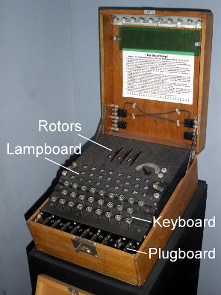

% Lessons Learned from Enigma
% Paul Waring
% April 6, 2017

# whoami

 - Freelance PHP developer and Linux system administrator
 - Specialise in legacy code/systems and financial services
 - I like trains, politics and technology (@pwaring)

# Background

 - World War 2: 1939 - 1945
 - Germany + others (Axis) vs Britain + others (Allies)
 - Enigma used pre- and post-war (e.g. British colonies)
 - Other cryptographical systems, e.g. Lorenz, Purple

# Problem

 - Need to transmit messages across long distances
 - Sender and recipient are not in fixed locations
 - Messages are time sensitive
 - Line of sight not guaranteed
 - Cables take time to run and can be cut
 - Only available technology: radio

# Radio

 - Radio signals are broadcast
 - Anyone can listen
 - Anyone can broadcast
 - Ideally want authentication, integrity and encryption
 - Will focus mainly on encryption

# Enigma as an example

 - Demonstrates flaws in design
 - Demonstrates flaws in operation
 - State vs state - significant resources available
 - Highest stakes possible
 - Probably the biggest 'hack' in history
 - War shortened by 1-2 years, millions of lives saved

# The machine

# Operation

 - Effectively a polyalphabetic substitution cipher
 - Plugboard: Swaps pairs of letters
 - Rotors: Position and starting letter
 - Press plaintext on keyboard, ciphertext lamp lights up
 - Reversible - same settings for decipherment

# Key distribution and exchange

 - Key was plugboard and rotor settings
 - Monthly book which contained settings for each day
 - Day key used to exchange a message key
 - Message key transmitted twice
 - Message key had same rotor order and plugboard as day key

# Traffic analysis

 - Can triangulate radio signals to get rough location
 - Track operators by fingerprint
 - Useful even if message text is unknown
 - Sometimes gives clues for codebreaking
 - Similar to metadata from emails, websites etc.

# Design

 - Enigma could never encrypt a character as itself
 - Helps eliminate potential keys
 - Plaintext guessing using cribs

# Operational rules

 - Rule against having rotors in same position for more than 2 days
 - No swapping plugboard letters with neighbours
 - Preventing 'obvious' combinations reduced key space

# Plaintext knowledge

 - Knowing (or guessing) some of the plaintext helps with codebreaking
 - Knowing the position of plaintext is even better (can be guessed)
 - Army reports tend to be structured and regular (e.g. weather)
 - 'Nothing to report' reports
 - Intentionally cause known messages to be sent ('gardening')

# Compromised keys

 - Capture a U-boat and you have the keys
 - Germans did not always revoke keys after capture (expensive)
 - Reliance on U-boat crew destroying keys
 - Extremely dangerous operation, but rewarding

# U-33

 - Sent to lay mines in Scottish waters
 - Normal procedure: no Enigma machines or codes on mine-layers
 - Procedure ignored, crew and parts of Enigma machine captured

# Per-message keys

 - Choose a new key per message, encrypted with the day book setting
 - Reduces the amount of ciphertext using the day book setting
 - Send key twice to avoid transmission problems (initially)
 - Obtain the day key and you have the message keys

# Guessable message keys

 - People can't choose truly random sequences
 - Operators choose their/partner's initials etc. ('cillies')
 - Operators re-use keys
 - Actual key space much lower than theorectical key space
 - Similar to card PINs today

# Faith in security

 - Enigma assumed to be unbreakable
 - Reasonable assumption *if used correctly*
 - Occasionally not using decrypted messages
 - Send spotter planes to known U-boat locations
 - Assumption of spies etc. instead of code breakers
 - Zimmerman telegram (WWI)

# Lessons learned

 - Key space can be reduced by flaws in design and operation
 - Reduced key space + automation = brute force can work
 - Repetition, re-use and regularity undermines cryptography
 - Traffic analysis can sidestep encryption and aid codebreaking
 - If keys are lost, assume they have been compromised
 - No system survives first contact with users

# Thanks for listening

 - Questions?
 - Slides at: talks.phpdeveloper.org.uk
 - Bletchley Park trip mailing list: lists.xk7.net

## Further reading

 - The Code Book (Simon Singh)
 - Enigma: The Battle for the Code (Hugh Sebag-Montefiore)
 - Visit Bletchley Park and The National Museum of Computing
